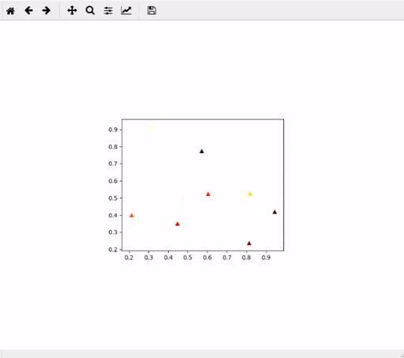

# Matplotlib-mosaic

Create plot mosaic. Example:



The class has two interfaces. The zero-state interface is used for creating a new plot mosaic. The load-state interface is used for loading a previously saved mosaic.

Dependencies:

* Numpy
* Matplotlib

## Example usage

Creating the plot mosaic from scratch (zero-state interface)

```python

import mpl_mosaic
import numpy as np

# Function used for creating the smaller plots. It receives a data 
# object and an axes. The function plots the data using a matplotlib 
# function. The function below receives the variable data containing 
# two lists, corresponding to x and y positions.
def plotFunc(data, ax):
	x = data[0]
	y = data[1]
	ax.plot(x, y, 'o', ms=3)

# Generate 10 points for the main axes
points = np.random.rand(10, 2)				
x, y = zip(*points)

# Generate some colors for the points
colors = np.random.rand(10)		

# Set some properties for points in the main axes
mainPlotKwargs = {'marker':'^', 'c':colors, 'cmap':'hot'}

# Generate 10 arrays of 100 points, each array corresponding to 
# a point in the main axes
allData = np.random.rand(10, 2, 100)

mosaic = mpl_mosaic.PlotMosaic(x, y, allData, dragPlotter=plotFunc, mainPlotKwargs=mainPlotKwargs)

# You can save the mosaic for latter use
mosaic.saveState('mosaic.dat')

```

Loading a previously saved mosaic (load-state interface)

```python

import mpl_mosaic

mosaic = mpl_mosaic.PlotMosaic('mosaic.dat')

```

Quick note, if you want the draggable plot to contain images, you can set the plotting function as

```python

def plotFunc(img, ax):
	ax.imshow(img)
		
```
